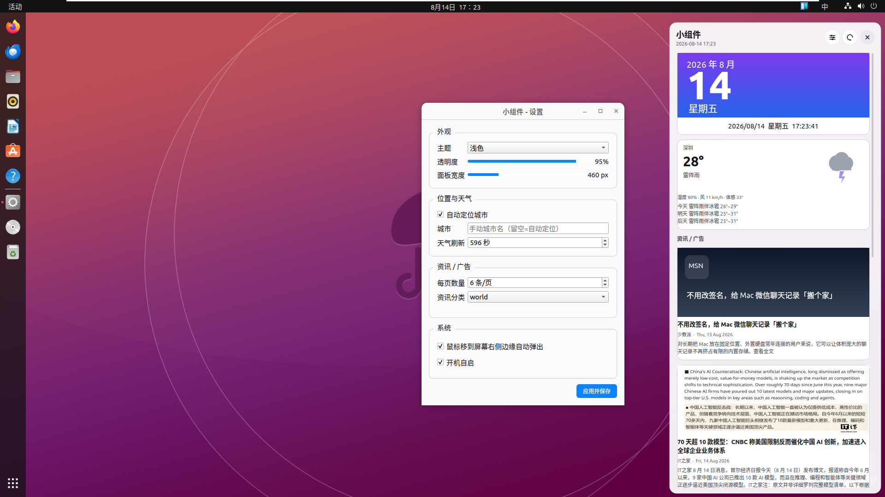
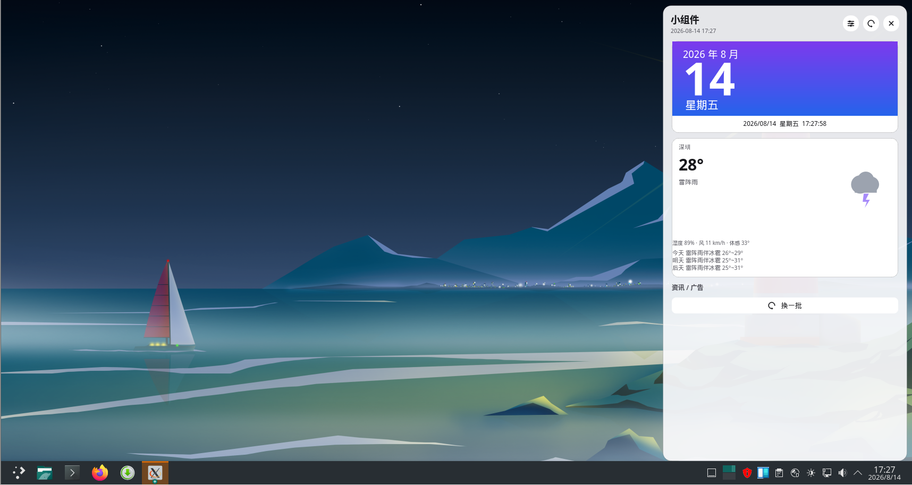

# Windows 小组件 for Linux

仿照 Windows 11 小组件面板的 Linux 桌面小组件，从屏幕右侧边缘滑入显示，集成资讯/新闻、天气预报、日期时钟，并提供图形化设置。

## 功能特性

- **边缘触发**：光标移到屏幕右侧边缘自动滑入显示，点击面板外自动收起
- **资讯卡片**：MSN 信息流 + 多源 RSS（IT之家、Engadget、ArsTechnica、少数派、TechCrunch、Wired、GitHub Blog 等），点击打开原文，封面后台异步加载
- **智能去重**：跨刷新记录已看资讯，优先展示新内容，避免重复
- **实时天气**：自动定位城市，定时刷新，支持手动指定城市
- **日期时钟**：自绘封面卡片，实时时钟
- **图形设置**：独立设置窗口，支持深色/浅色主题、透明度、组件数量、资讯分类、自启等
- **开机自启**：默认开启，可在设置中关闭
- **状态缓存**：每 5 分钟保存一次，下次启动秒开
- **多显示器**：跟随光标所在屏幕弹出

## 使用截图

截图放在 `img/` 目录下，可在此添加：

```


```

## 环境依赖

- Python 3.8+
- PyQt5
- requests
- Pillow
- X11 环境（依赖自由窗口定位，不支持 Wayland 原生会话，可在 XWayland 下运行）

## 安装方法

### 方式一：deb 包（Debian/Ubuntu/Mint）

适用于 Debian 系发行版，需 root 权限。

```bash
# 构建 deb 包（首次）
./build_deb.sh

# 安装
sudo dpkg -i widget-panel_1.0.0_all.deb
# 如缺依赖：
sudo apt-get install -f
```

安装后通过命令 `widget-panel` 或应用菜单中的"小组件"启动。

### 方式二：通用安装脚本（推荐，跨发行版）

自动识别发行版并安装系统依赖，支持 Debian/Ubuntu、Fedora/RHEL、Arch/Manjaro、openSUSE。

```bash
sudo ./install.sh
```

安装完成后：
- 命令行：`widget-panel`
- 菜单：搜索"小组件" / Widget Panel

卸载：

```bash
sudo ./uninstall.sh
```

### 方式三：源码运行（开发调试）

```bash
# 安装依赖（以 Debian 为例）
sudo apt-get install python3-pyqt5 python3-requests python3-pil libxcb-cursor0 libxcb-xinerama0

# 直接运行
python3 -m widget_panel.main
```

## 打包 deb

```bash
./build_deb.sh
```

生成的包：`widget-panel_1.0.0_all.deb`

## 配置说明

配置文件位置：`~/.config/widgetpanel/settings.json`

| 配置项 | 说明 | 默认值 |
|--------|------|--------|
| `auto_locate` | 自动定位城市 | `true` |
| `city_override` | 手动指定城市 | 空 |
| `weather_refresh_seconds` | 天气刷新间隔（秒） | `600` |
| `news_count` | 每页资讯数量 | `6` |
| `news_categories` | 资讯分类 | `["world","technology","entertainment","sports"]` |
| `panel_width` | 面板宽度 | `460` |
| `edge_trigger` | 边缘触发 | `true` |
| `auto_start` | 开机自启 | `true` |
| `theme_mode` | 主题模式 | `"dark"` |
| `opacity` | 透明度（0-100） | `92` |

所有配置均可在设置窗口中修改，无需手动编辑文件。

## 目录结构

```
.
├── widget_panel/          # 主程序包
│   ├── main.py            # 入口：托盘 + 边缘触发 + 控制器
│   ├── panel.py           # 面板布局与动画
│   ├── cards.py           # 卡片控件（资讯/天气/日期）
│   ├── news_service.py    # 资讯抓取（MSN + RSS）
│   ├── weather_service.py # 天气与定位
│   ├── cache_service.py   # 状态缓存
│   ├── settings_window.py # 设置窗口
│   ├── styles.py          # 主题样式
│   ├── resources.py       # 图标资源生成
│   └── config.py          # 配置与路径
├── scripts/
│   └── generate_icon.py   # 图标生成脚本
├── install.sh             # 通用安装脚本
├── uninstall.sh           # 卸载脚本
├── build_deb.sh           # deb 打包脚本
├── requirements.txt       # Python 依赖
├── setup.py               # 打包配置
└── widget_panel.desktop   # 桌面菜单项
```

## 技术栈

- **GUI**：PyQt5（固定使用 xcb 平台插件，保证窗口定位能力）
- **网络**：requests + ThreadPoolExecutor 并行抓取
- **数据源**：MSN 信息流（首选）、多源 RSS（回退）
- **天气**：Open-Meteo API + IP 地理定位
- **缓存**：JSON 本地缓存，5 分钟定时保存

## 已支持的发行版

| 发行版 | 包管理器 | 状态 |
|--------|----------|------|
| Debian/Ubuntu/Mint/Pop!_OS | apt | 已验证 |
| Fedora/RHEL/Rocky/Alma | dnf | 已支持 |
| Arch/Manjaro/EndeavourOS | pacman | 已支持 |
| openSUSE/SLES | zypper | 已支持 |

## 许可证

本项目仅供学习交流使用。
